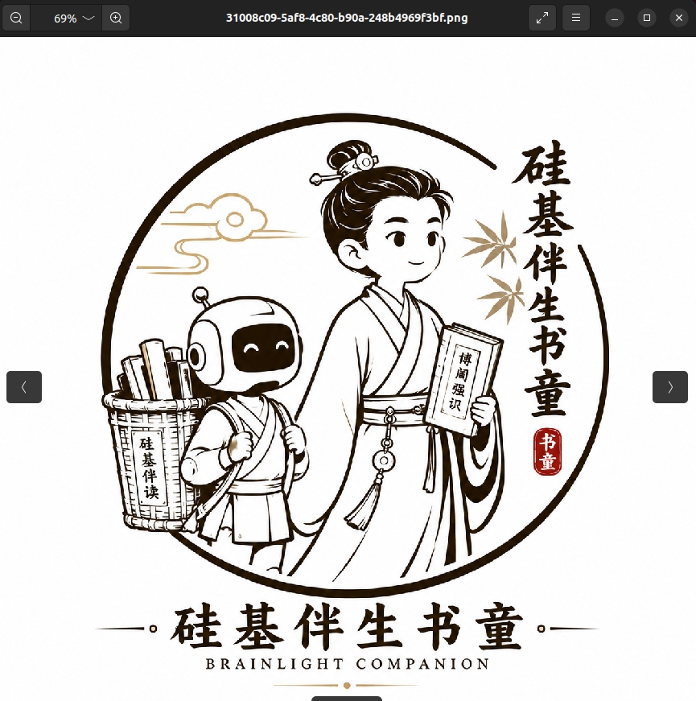
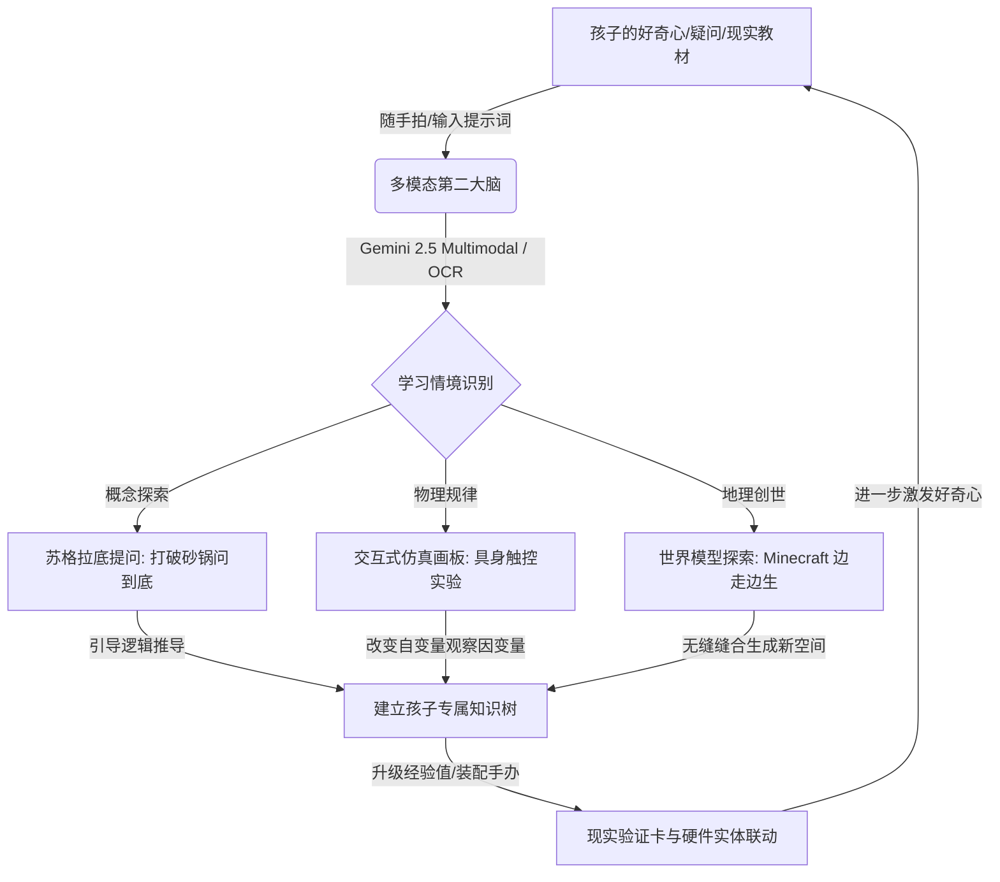
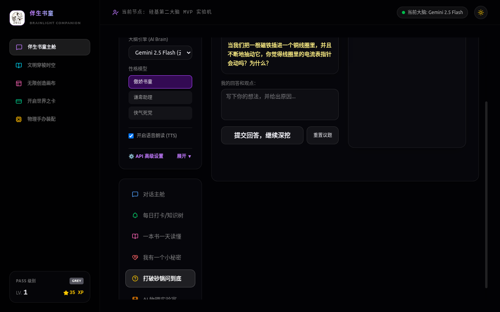
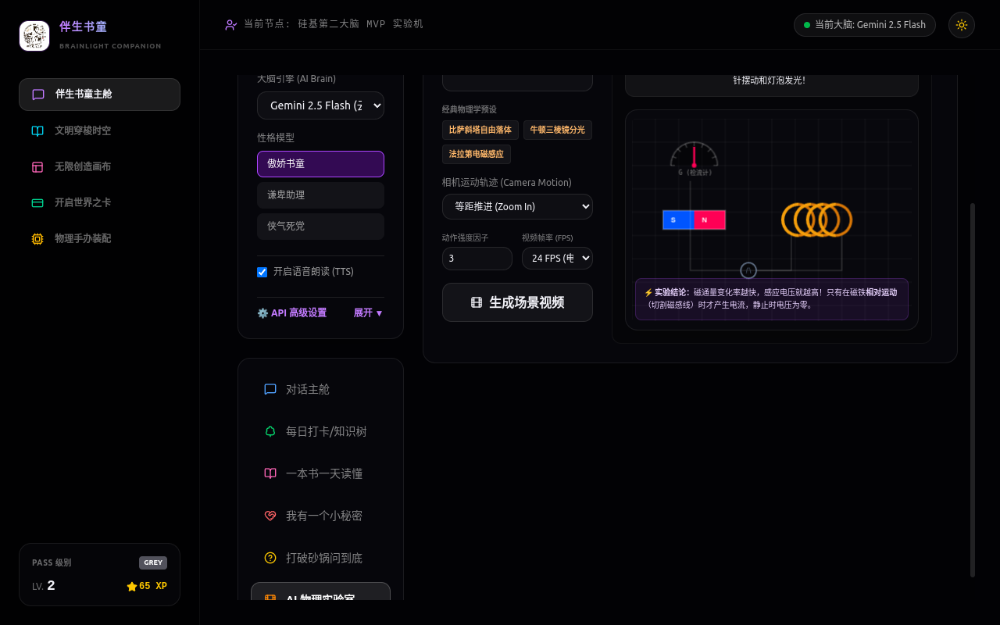
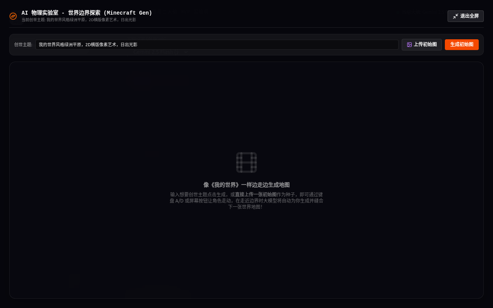

# 硅基伴生书童 (Silicon-Based Companion Book-Boy)

  

> **Brainlight (统子哥黑娃) 旗下核心教育智能体子项目**
> 
> 致力于探索**人机协同下的自主学习与苏格拉底启发式教育新范式**。本项目是一个基于 React + Vite 的超轻量级、便携式静态前端应用，旨在通过 AI 动力与物理学仿真构建孩子身边的“个性化第二大脑”。

---

## 🌟 核心教育理解与哲学 (Educational Philosophy)

传统的教育系统多采用**单向灌输 (Passive Feeding)** 的方式，导致孩子在面对公式和课本时容易失去内生性的求知欲。硅基伴生书童从底层架构设计上尝试改变这一现状，确立了以下三大教育探索核心：

### 1. 摒弃直接答案，推行“苏格拉底式启发问答 (Socrates Inquiry)”
* **学习并非灌输，而是自主发现**：在书童的“打破砂锅问到底”模式中，当孩子输入一个疑问时，AI 绝对不会直接给出一大段死板的标准答案。
* **层层引导**：AI 会退一步，提出一个更基础的子问题（如：“如果你将磁铁快速插进线圈，指针会动吗？为什么呢？”），引导孩子自己去观察、思考并推导出原理。
* **温和引导**：如果孩子答错了或者遇到困难，AI 会给出一个直观的生活线索（Scaffolding Hints）或转换提问角度，确保每一次认知跃迁都是由孩子大脑主动思考完成的。

### 2. 倡导物理规律的“具身式交互探索 (Interactive Physics Sandboxes)”
* **物理规律应当是可以触摸与修改的**：我们将经典物理学的核心概念做成了支持自变量拖拽的交互仿真引擎。
  * **伽利略自由落体**：任意调整铁球与羽毛的质量，选择在地球、月球或木星重力环境下释放，亲眼见证并记录两物体的加速度运动，打破“重物下落快”的直觉误区。
  * **牛顿三棱镜分光**：拖拽白光光束的入射角度，旋转棱镜，观察波长偏折与七彩彩虹光谱的实时投影，让折射定律在滑动中显现。
  * **法拉第电磁感应**：用鼠标快速拖拽磁铁穿过感应线圈。当运动速度越快、切割磁感线效率越高时，电压表的指针偏转幅度越大，灯泡也爆发出更明亮的光芒。

### 3. 驱动三维空间创想的“世界模型边界渲染 (Minecraft Gen)”
* **像《我的世界》一样边走边生成地图**：结合大模型生图能力，孩子可以自主选择创世主题（如：“像素艺术绿洲”、“赛博朋克荒漠”），或者直接上传一张手绘图/初始照片作为原初种子。
* **边界无限缝合**：键盘按 **A/D** 键或屏幕按钮控制小人在草地上行走，当小人走近地图左右边界时，大模型会基于原图在后台自动缝合、渲染生成下一幅无缝过渡的地图块。将自主空间探险与 AI 创世完美结合，极大开阔了空间创造视野。

### 4. 现实世界的软硬件联动 (Physical Hardware Integration)
* **开启世界之卡**：配合孩子的现实验证卡（XP 等级体系）和本地 ESP32 机器人手办装配指示，让虚拟世界里的学习积分（Talent Radar）与现实世界的手办实体结合，将数字陪伴实体化。

---

## 📸 实机画面与场景展示 (Visuals & Showcase)

### 1. 伴生书童主舱视口 (Silicon Companion Main Cabin)
拥有傲娇书童、谦卑助理、侠气死党等多套情感与性格 of 对话主舱。内置本地大模型/云端 Gemini 双引擎切换配置，支持随手上传教材图片、课本习题，一键进行 Gemini 多模态深度分析与 Tesseract.js 本地 OCR 错题提取，自动沉淀为用户的本地知识树节点。

### 2. 苏格拉底启发式对话 (Socratic Logical Scaffolding)
打破砂锅问到底的苏格拉底探索纪要面板。不提供现成标准答案，而是以深度进阶提问的形式，引导小主人一步步探索科学边界，让思考真正发生。

### 3. 物理实验室交互仿真 (Educational Physics Simulations)
包含法拉第电磁感应切割磁感线发电机、牛顿折射棱镜分光与伽利略加速度重力滑块实验的交互视口，通过调整参数直观体验物理法则。

### 4. 世界模型全屏探索沙盒 (Minecraft Gen Infinite Exploration)
进入无缝 Portal 全屏大视口后，小人和地图随显示器分辨率自适应拉伸。支持使用 One API 混元世界模型，在小人走向边界时自动无边界渲染、扩建新像素场景地图。

---

## 🚀 极速部署与运行指南 (Getting Started)

### Vercel 一键云端静态托管
本项目由于是 100% 静态前端，您可以直接在 Vercel 官网上实现免费托管：
1. 登录 [Vercel 官网 Dashboard](https://vercel.com/dashboard)，点击 **Add New -> Project**。
2. 关联并选择导入您的 GitHub 仓库 `blue1one2two-crypto/brainlight-companion`。
3. Vercel 会自动识别 Vite 框架配置，无需做任何参数修改，直接点击 **Deploy** 即可发布公网网址。
4. **大模型代理配置**：在部署页面的 Environment Variables 中配置您的 API Key 环境变量：
   * `VITE_GEMINI_API_KEY`：云端 Gemini API Key（支持在国内网络环境配置反向代理 Base URL）。
   * `VITE_SUPABASE_URL` 及 `VITE_SUPABASE_ANON_KEY`：云端知识记录数据库。

### 本地微型一键运行便携版 (绿色免安装)
在下载的 `伴生书童-BrainLight_Companion.zip` 压缩包解压目录下，我们已经配置了绿色脚本：
* **Windows 环境**：双击运行 `双击运行_Windows.bat`。
* **Linux/Mac 环境**：双击运行或终端执行 `双击运行_Linux_Mac.sh`。

脚本会自动调用您电脑上的轻量 Web 模块，在默认浏览器自动拉起 `http://localhost:8000` 端口进入完整的离线静态交互界面。如果在无 Python 环境的计算机上，亦可以直接双击 `dist/index.html` 离线体验前端动画交互。
